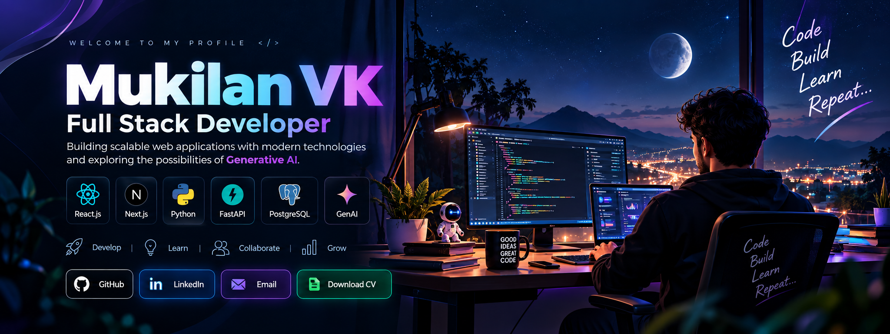

 

---

## 👋 About Me

I'm **Mukilan VK**, a Full Stack Developer focused on building scalable, responsive and user-focused web applications.

- ⚛️ React.js & Next.js
- 🐍 Python & FastAPI
- 🗄️ PostgreSQL & MongoDB
- 🔗 REST API development and integration
- 🎨 Responsive UI development
- 🤖 Generative AI and AI-assisted development
- 🚀 Interested in modern full-stack application architecture

---

## 🛠️ Tech Stack

  

**AI-Assisted Development:** Antigravity • Windsurf • Cursor • Codex

---

## 🚀 Featured Projects

### 🎓 Everest Tutoring
Production e-learning and examination platform for an Australian client.

**React.js • Python • FastAPI • PostgreSQL**

- GATE and UCAT modules
- Online examinations and practice tests
- Admin and CRM workflows
- Student and tutor workflows
- Supports 500+ students

### 🌐 EventSphere
Venue booking platform for marriages, conferences, corporate events, parties and other functions.

**React.js • Python • FastAPI**

### 📝 Moneypechu
SEO-friendly blog and content platform built with Next.js.

**Next.js**

### 🤖 Personal Gemini Journal
AI-powered journaling application using Gemini with user-isolated data.

**Next.js • Firebase • Firestore • Gemini**

### 🚦 Traffic Time Saver
Machine-learning-based traffic management application for vehicle counting and dynamic traffic signal timing.

**Python • Machine Learning**

### 📚 Everest Booklet
Booklet management application with document and export workflows.

**React.js • TypeScript • Material UI**

---

## 💼 Professional Experience

| Company | Role | Period |
|---|---|---|
| **Aagnia Technology** | Full Stack Developer | May 2025 – Present |
| **XYLOITE Technology** | Associate Software Engineer | Apr 2024 – Dec 2024 |
| **Xylonic Technology** | Software Engineer Intern | Oct 2023 – Mar 2024 |

---

## 📊 GitHub Stats

  

---

## 🏆 Certification

**Google Cloud Gen AI Academy APAC Edition – Cohort 3**

Completed

`Certificate ID: 2026H2S09GCGENAIAPACC3-P01666`

---

## 📄 Publication

**Efficient Algorithm for Recognition of Handwritten Characters**

Published at **ICICT — International Conference on Computing and Technology**.

---

## 🎓 Education

**M.Sc — Computer Science**  
Sri Krishna College of Arts and Science, Coimbatore — 2022–2024

**B.Sc — Computer Science**  
Kovai Kalaimagal Arts and Science College, Coimbatore — 2019–2022

---

## 🤝 Connect With Me

<a href="https://github.com/mukilanvk">GitHub</a> •
<a href="https://www.linkedin.com/in/mukilan-karupusamy-94560a283">LinkedIn</a> •
<a href="mailto:vkmukilan@gmail.com">Email</a>

  

⭐ **Thanks for visiting my profile!**

